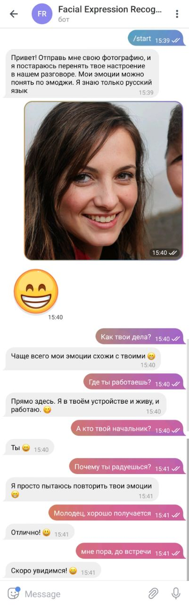
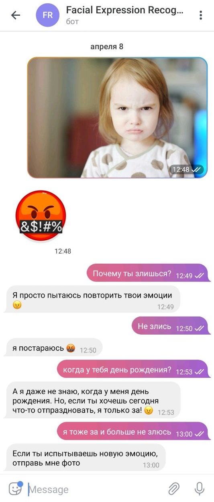
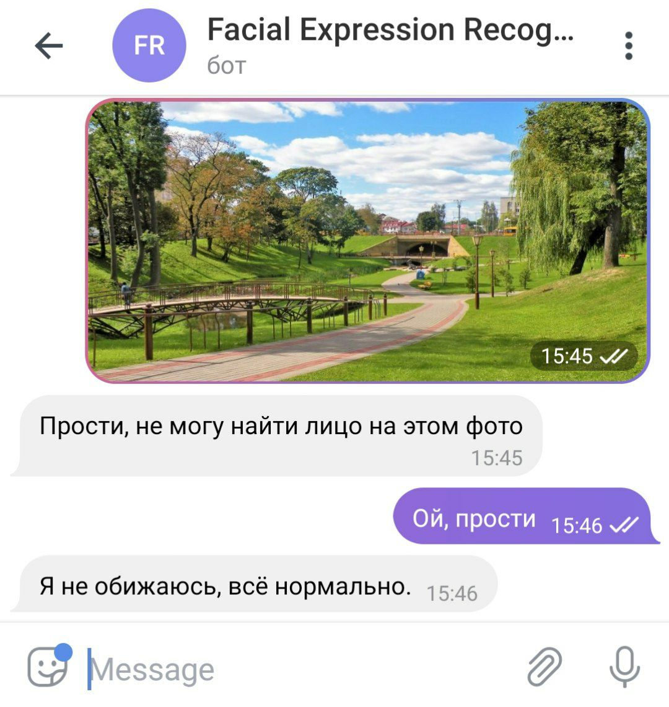

## Бот, который распознает эмоцию пользователя по фото и перенимает ее
**Выполнили студентки 451 группы**
**Крулева Маргарита и Бебешко Алена**

Распознавание эмоций производится с помощью предобученной модели из бибилотеки rmn (Residual Masking Network).  
Для поддержки диалогов используется агент dialogflow.

###Принцип работы
Бот определяет эмоцию пользователя на фото (sad, happy, surprise, angry, fear, disgust, neutral), 
и затем в диалоге ставит соответствующие смайлы.
Бот работает только при запуске кода.

t.me/photo_emotion_recognition_bot 

#### Примеры работы бота

На первом скринее бот распознал на картинке счастливое лицо и добавляет в конце предложения веселые смайлы.

На втором скрине распозналась злость, и бот с помощью эмоджи пытается ее передать

На третьем скрине не найдено ни одного лица, и бот принимает нейтральное состояние

